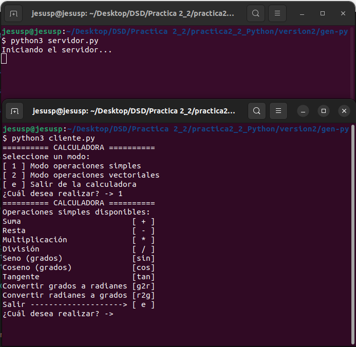
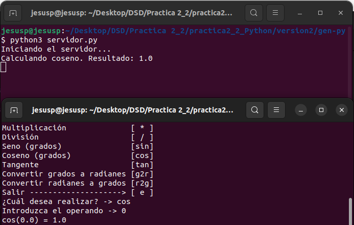
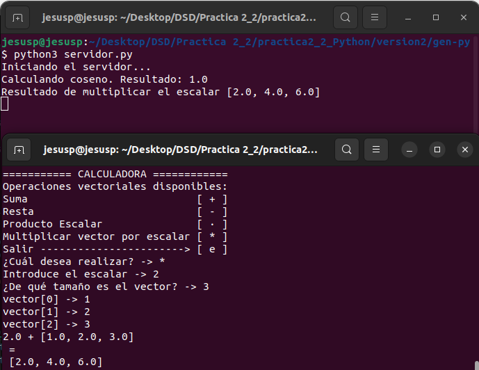
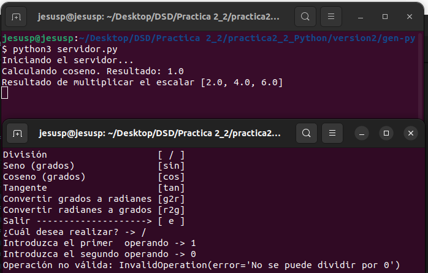

---
author:
- Jesús Pereira Sánchez
title: "PRÁCTICA 2_2: Apache Thrift"
---

# Primera Aproximación

En la primera versión del programa, la calculadora solo realizará
operaciones simples como suma, resta, multiplicación, división, algunas
operaciones trigonométricas (seno, coseno, tangente) en grados y
conversión de grados a radianes y viceversa.

## Representación del problema

La representación del problema será similar que en la práctica 2:

``` {frame="single"}
struct Operation 
{
  double member1;
  double member2;
  Operations operating;
};
```

**struct Operation** crucial para la calculadora.

Para añadir un poco más de complejidad al problema, las operaciones
serán parte de un enumerado.

## Archivo calculadora.thrift

Gracias a este archivo generamos la comunicación entre el servidor y
cliente, así como los datos y servicios que formarán parte del problema.
Definimos el enumerado de las operaciones disponibles, la estructura de
operación y los servicios del servidor:

``` {frame="single"}
/* calculadora.thrift */
enum Operations
{
   ADD = 0;
   SUB = 1;
   MUL = 2;
   DIV = 3;
   SIN = 4;
   COS = 5;
   TAN = 6;
   CONVg_r = 7,
   CONVr_g = 8
}

struct Operation
{
   1: optional double member1;
   2: optional double member2;
   3: optional Operations operating
}

service Calculadora
{
   double calculate(1:Operation op)
}
```

## Servidor

Tal y como hemos definido los tipos de datos que se van a pasar entre el
servidor y el cliente, la tarea del handler del servidor es sencilla:
**Identifica la operación, calcula el resultado y lo devuelve al cliente
que lo solicitó**. Por ello, tendrá un código simple:

::: mintedbox
python class CalculadoraHandler: def \_\_init\_\_(self): self.log =

def calculate(self, op): match op.operating: case Operations.ADD: return
op.member1 + op.member2 case Operations.SUB: return op.member1 -
op.member2 case Operations.MUL: return op.member1 \* op.member2 case
Operations.DIV: return op.member1 / op.member2 case Operations.COS:
return math.cos(math.radians(op.member1)) case Operations.SIN: return
math.sin(math.radians(op.member1)) case Operations.TAN: return
math.tan(math.radians(op.member1)) case Operations.CONVg_r: return
math.radians(op.member1) case Operations.CONVr_g: return
math.degrees(op.member1)
:::

Para las operaciones trigonométricas y las de conversión de grados y
radianes usamos el módulo **math** de Python (*import math*).

Por otro lado, la comunicación. Usaremos el código de servidor
proporcionado como ejemplo para la práctica.

## Cliente

El código del cliente es más complejo. Por un lado, tenemos la
comunicación con el servidor ya implementada, por lo que solo tenemos
que hacer la parte de meter las operaciones en los tipos de datos
definidos, enviarlos, y mostrar lo que recibimos.

### Cargamos los datos

Al igual que en la práctica anterior, lo haremos de forma interactiva
desde la terminal. Preguntamos al usuario el operando, y los miembros de
la operación. Aqui filtramos la entrada no válida de algunos valores no
válidos como letras o un 0 como segundo operando de la división
(temporalmente hasta añadir el uso de excepciones). El código del
cliente sería el siguiente:

::: mintedbox
python if \_\_name\_\_ == \"\_\_main\_\_\": transport =
TSocket.TSocket(\"localhost\", 9090) transport =
TTransport.TBufferedTransport(transport) protocol =
TBinaryProtocol.TBinaryProtocol(transport)

client = Calculadora.Client(protocol)

transport.open()

operacion = Operation()

option = \"\"

while(option != \"e\"): print_menu() option = input() if option !=
\"e\": if option == \"+\" or option == \"-\" or option == \"\*\" or
option == \"/\": correct = False validInput = False while not correct:
while not validInput: try: validInput = True operacion.member1 =
float(input(\"Introduzca el primer operando -\> \")) except ValueError:
print(\"Por favor introduzca un número\") validInput = False

validInput = False while not validInput: try: validInput = True
operacion.member2 = float(input(\"Introduzca el segundo operando -\>
\")) except ValueError: print(\"Por favor introduzca un número\")
validInput = False

if operacion.member2 == 0 and option == \"/\" : print(\"\[ERROR\] No se
puede dividir por 0\") else: correct = True

match option: case \"+\": operacion.operating = Operations.ADD case
\"-\": operacion.operating = Operations.SUB case \"\*\":
operacion.operating = Operations.MUL case \"/\": operacion.operating =
Operations.DIV

print(f\"operacion = client.calculate(operacion)\")

elif option == \"sin\" or option == \"cos\" or option == \"tan\" or
option == \"g2r\" or option == \"r2g\": validInput = False while not
validInput: try: validInput = True operacion.member1 =
float(input(\"Introduzca el operando -\> \")) except ValueError:
print(\"Por favor introduzca un número\") validInput = False

match option: case \"sin\": operacion.operating = Operations.SIN case
\"cos\": operacion.operating = Operations.COS case \"tan\":
operacion.operating = Operations.TAN case \"g2r\": operacion.operating =
Operations.CONVg_r case \"r2g\": operacion.operating =
Operations.CONVr_g

print(f\"operacion = client.calculate(operacion)\")

else: print(\"Operación no válida. Por favor, introduzca una operación
de entre las disponibles\")

transport.close()
:::

Es en la línea 80 cuando mandamos al servidor la operación a realizar.

# Solución Final

En esta versión se han actualizado varios apartados:

-   **Nuevas Operaciones Vectoriales**: Se ha añadido la opción de
    trabajar con vectores. Algunas de las operaciones que incluye esta
    versión son la suma, la resta, multiplicación de un escalar por un
    vector y el producto escalar de 2 vectores. Cabe destacar que estas
    operaciones se hacen con vectores de 3 dimensiones, que son los
    vectores que normalmente se usan para un espacio Cartesiano R3

-   **Control de excepciones**: Aprovechando el control de excepciones
    de Python, ahora protegemos al servidor ante cualquier operación que
    pueda mandar el cliente (divisiones por 0 y operaciones con vectores
    nulos). Además, en el cliente controlamos la conexión al servidor y
    la ejecución de este mismo con una excepción.

## Archivo calculadora.thrift

Hemos actualizado el archivo para poder meter las excepciones, las
operaciones con vectores (en el enumerado y el tipo de dato de operación
con vector) y el nuevo servicio de cálculo de vectores:

``` {frame="single"}
enum Operations
{
   ADD = 0;
   SUB = 1;
   MUL = 2;
   DIV = 3;
   SIN = 4;
   COS = 5;
   TAN = 6;
   CONVg_r = 7,
   CONVr_g = 8,
   P_Esc = 9,
   MUL_Esc = 10
}

struct Operation
{
   1: optional double member1;
   2: optional double member2;
   3: optional Operations operating
}

struct vector_Operation
{
   1: optional list<double> member1;
   2: optional list<double> member2;
   3: optional Operations operating
}

exception InvalidOperation {
  1: string error
}

service Calculadora
{
   double calculate(1:Operation op) throws (1:InvalidOperation e),
   list<double> calculateVec(1:vector_Operation op) throws (1:InvalidOperation e)
}
```

En orden, las operaciones disponibles de la calculadora, la estructura
de operación simple, la estructura de operación vectorial, la excepción
de operación no válida que devuelve el servidor y la definición del
servicio con sus respectivos procedimientos

## Servidor

Este servidor es parecido al anterior. Tenemos dos procedimientos:

-   **Operaciones simples**

-   **Operaciones vectoriales**

::: mintedbox
python class CalculadoraHandler: def \_\_init\_\_(self): self.log =

def calculate(self, op): match op.operating: case Operations.ADD: result
= op.member1 + op.member2 print(f\"Calculando suma. Resultado: result\")
return result case Operations.SUB: result = op.member1 - op.member2
print(f\"Calculando resta. Resultado: result\") return result case
Operations.MUL: result = op.member1 \* op.member2 print(f\"Calculando
multiplicacion. Resultado: result\") return result case Operations.DIV:
if op.member2 == 0: raise InvalidOperation(\"No se puede dividir por
0\") result = op.member1 / op.member2 print(f\"Calculando division.
Resultado: result\") return result case Operations.COS: result =
math.cos(math.radians(op.member1)) print(f\"Calculando coseno.
Resultado: result\") return result case Operations.SIN: result =
math.sin(math.radians(op.member1)) print(f\"Calculando seno. Resultado:
result\") return result case Operations.TAN: result =
math.tan(math.radians(op.member1)) print(f\"Calculando tangente.
Resultado: result\") return result case Operations.CONVg_r: result =
math.radians(op.member1) print(f\"Convirtiendo a radianes. Resultado:
result\") return result case Operations.CONVr_g: result =
math.degrees(op.member1) print(f\"Convirtiendo a grados. Resultado:
result\") return result

def calculateVec(self, op): result = \[\] match op.operating: case
Operations.ADD: if len(op.member1) == len(op.member2) and
len(op.member1) \> 0: for i in range(len(op.member1)):
result.append(op.member1\[i\] + op.member2\[i\]) print(f\"Resultado de
la suma de vectores result\") return result else: raise
InvalidOperation(\"El tamaño de los vectores debe de ser el mismo,
ademas de no nulo\") case Operations.SUB: if len(op.member1) ==
len(op.member2) and len(op.member1) \> 0: for i in
range(len(op.member1)): result.append(op.member1\[i\] - op.member2\[i\])
print(f\"Resultado de la resta de vectores result\") return result else:
raise InvalidOperation(\"El tamaño de los vectores debe de ser el mismo,
ademas de no nulo\") case Operations.P_Esc: if len(op.member1) ==
len(op.member2) and len(op.member1) \> 0: for i in
range(len(op.member1)): result.append(0) result\[0\] += (op.member1\[i\]
\* op.member2\[i\]) print(f\"Resultado del producto escalar result\")
return result else: raise InvalidOperation(\"El tamaño de los vectores
debe de ser el mismo, ademas de no nulo\") case Operations.MUL_Esc: if
len(op.member2) \> 0: for i in range(len(op.member2)):
result.append((op.member1\[0\] \* op.member2\[i\])) print(f\"Resultado
de multiplicar el escalar result\") return result else: raise
InvalidOperation(\"Introduzca un escalar y un vector de tamaño no
nulo\")
:::

## Cliente

El cliente se encarga de enseñar las operaciones disponibles y de cargar
estas para mandarlas al servidor y mostrarlas, haciendo uso de las
excepciones. Los diferentes menús por los que se puede navegar son:

    ========== CALCULADORA ========== 
    Seleccione un modo:
    [ 1 ] Modo operaciones simples    
    [ 2 ] Modo operaciones vectoriales
    [ e ] Salir de la calculadora     
    ¿Cuál desea realizar? -> 

    Para las operaciones simples:
    ========== CALCULADORA ==========
    Operaciones simples disponibles:
    Suma                        [ + ]
    Resta                       [ - ]
    Multiplicación              [ * ]
    División                    [ / ]
    Seno (grados)               [sin]
    Coseno (grados)             [cos]
    Tangente                    [tan]
    Convertir grados a radianes [g2r]
    Convertir radianes a grados [r2g]
    Salir --------------------> [ e ]
    ¿Cuál desea realizar? -> 

    Para las operaciones vectoriales:
    =========== CALCULADORA ============
    Operaciones vectoriales disponibles:
    Suma                           [ + ]
    Resta                          [ - ]
    Producto Escalar               [ · ]
    Multiplicar vector por escalar [ * ]
    Salir -----------------------> [ e ]
    ¿Cuál desea realizar? ->

Se ha modularizado las distintas tareas a realizar para que quede un
main conciso:

::: mintedbox
python if \_\_name\_\_ == \"\_\_main\_\_\": transport =
TSocket.TSocket(\"localhost\", 9090) transport =
TTransport.TBufferedTransport(transport) protocol =
TBinaryProtocol.TBinaryProtocol(transport)

client = Calculadora.Client(protocol)

try: transport.open() except: print(\"No se encontró el servidor\")
sys.exit(1)

option = \"\" while (option != \"e\"): printMainMenu() option = option =
input(\"¿Cuál desea realizar? -\> \") if (option != \"e\"): match
option: case \"1\": doSimpleOperation() case \"2\": doVectorOperation()

transport.close()
:::

Por un lado tenemos la realización de una operación simple, que es
similar a la de la versión anterior:

::: mintedbox
python def doSimpleOperation(): operacion = Operation() option = \"\"
while(option != \"e\"): printSimpleOperationMenu() option =
input(\"¿Cuál desea realizar? -\> \") if option != \"e\": if option ==
\"+\" or option == \"-\" or option == \"\*\" or option == \"/\": correct
= False validInput = False

while not validInput: try: validInput = True operacion.member1 =
float(input(\"Introduzca el primer operando -\> \")) except ValueError:
print(\"Por favor introduzca un número\") validInput = False

validInput = False while not validInput: try: validInput = True
operacion.member2 = float(input(\"Introduzca el segundo operando -\>
\")) except ValueError: print(\"Por favor introduzca un número\")
validInput = False

match option: case \"+\": operacion.operating = Operations.ADD case
\"-\": operacion.operating = Operations.SUB case \"\*\":
operacion.operating = Operations.MUL case \"/\": operacion.operating =
Operations.DIV

try: print(f\"operacion = client.calculate(operacion)\") except
InvalidOperation as error: print(\"Operación no válida:

elif option == \"sin\" or option == \"cos\" or option == \"tan\" or
option == \"g2r\" or option == \"r2g\": validInput = False while not
validInput: try: validInput = True operacion.member1 =
float(input(\"Introduzca el operando -\> \")) except ValueError:
print(\"Por favor introduzca un número\") validInput = False

match option: case \"sin\": operacion.operating = Operations.SIN case
\"cos\": operacion.operating = Operations.COS case \"tan\":
operacion.operating = Operations.TAN case \"g2r\": operacion.operating =
Operations.CONVg_r case \"r2g\": operacion.operating =
Operations.CONVr_g

try: print(f\"operacion = client.calculate(operacion)\") except
InvalidOperation as error: print(\"Operación no válida: else:
print(\"Operación no válida. Por favor, introduzca una operación de
entre las disponibles\")
:::

Y por otro lado tenemos la realización de las operaciones vectoriales:

::: mintedbox
python def doVectorOperation(): operacion = vector_Operation(\[\], \[\])
option = \"\" while (option != \"e\"): printVectorOperationMenu() option
= input(\"¿Cuál desea realizar? -\> \") if (option != \"e\"): if option
== \"+\" or option == \"-\" or option == \"·\" or option == \"\*\": if
option == \"\*\": operacion.member1.append(float(input(\"Introduce el
escalar -\> \"))) validInput = False while not validInput: size =
int(input(\"¿De qué tamaño es el vector? -\> \")) if size \> 0:
validInput = True else: print(\"Introduzca un tamaño válido\") for i in
range(size): validInput = False while not validInput: try: validInput =
True operacion.member2.append(float(input(f\"vector\[i\] -\> \")))
except ValueError: print(\"Por favor introduzca un número\") validInput
= False

operacion.operating = Operations.MUL_Esc try: print(f\"operacion = \")
except InvalidOperation as error: print(\"Operación no válida:
operacion.member1.clear() operacion.member2.clear()

else: validInput = False while not validInput: size = int(input(\"¿De
qué tamaño son los vectores? -\> \")) if size \> 0: validInput = True
else: print(\"Introduzca un tamaño válido\") for i in range(size):
validInput = False while not validInput: try: validInput = True
operacion.member1.append(float(input(f\"vector1\[i\] -\> \"))) except
ValueError: print(\"Por favor introduzca un número\") validInput = False
for i in range(size): validInput = False while not validInput: try:
validInput = True operacion.member2.append(float(input(f\"vector2\[i\]
-\> \"))) except ValueError: print(\"Por favor introduzca un número\")
validInput = False

match option: case \"+\": operacion.operating = Operations.ADD case
\"-\": operacion.operating = Operations.SUB case \"·\":
operacion.operating = Operations.P_Esc

try: print(f\"operacion = \") except InvalidOperation as error:
print(\"Operación no válida: operacion.member1.clear()
operacion.member2.clear() else: print(\"Operación no válida. Por favor,
introduzca una operación de entre las disponibles\")
:::

# Manual de la calculadora

## Calculadora final

Programa final de la calculadora, operaciones simples, vectores y manejo
de excepciones. Nos situamos en la carpeta de gen_py, y ejecutamos en
terminales separadas cada uno de los programas (primero el servidor y
después el cliente)



Probamos una operación simple:



Vemos como el servidor tiene en su consola un historial de las
soluciones de las operaciones realizadas. Salimos del menú de
operaciones simples con la opción 'e', y luego seleccionamos las
operaciones vectoriales. Ahora una operación vectorial:



Probamos el uso de las excepciones (división por 0):



Vemos como no corta la ejecución ni del servidor ni del cliente, por lo
que se maneja bien la excepción.

