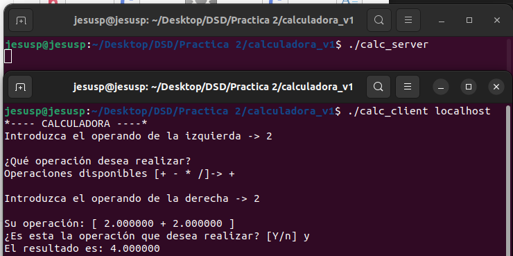
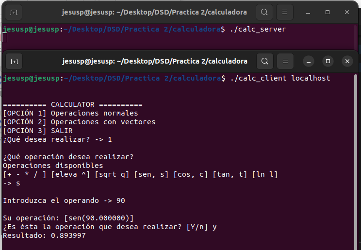
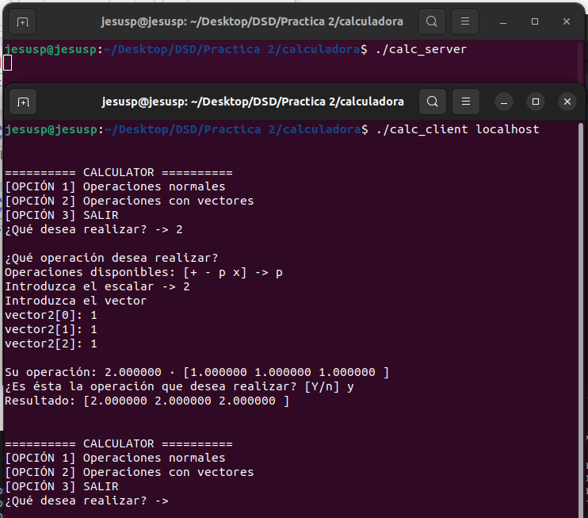

# DSD
 Prácticas de Desarrollo de Sistemas Distribuidos Curso 23/24

# PRÁCTICA 2: Llamada a procedimiento remoto (RPC)

# Primera Aproximación

En la primera versión del programa, la calculadora solo realizará
operaciones simples como lo son suma, resta, multiplicación y división
con números en coma flotante. La calculadora además, evitará operaciones
peligrosas como dividir por 0 y otro tipo de operaciones que no conozca.

## Representación del problema

Para representar el problema, nos valdremos de una estructura sencilla.
Abstraemos el concepto de operación, el cual se compone del operando de
la izquierda, el operando de la derecha y el operador. Sabiendo esto,
tenemos el siguiente struct:

``` {frame="single"}
struct operation 
{
  float operator1;
  float operator2;
  char operator;
};
```

**struct operator** crucial para la calculadora.

## Archivo calc.x

Gracias a este archivo generamos las plantillas, por lo que es crucial
como lo realicemos. En este archivo vamos a declarar nuestros tipos de
datos (**operation** y la unión para la devolución del resultado en caso
de error o no) y el procedimiento del servidor.

``` {frame="single"}
/* calc.x */
struct operation 
{
  float operator1;
  float operator2;
  char operator;
};

union operation_res switch (int errnum) 
{
  case 0:
    float result;  /* sin error: resultado */
  default:
    void;          /* con error: nada      */
};

program CALCULATOR 
{
  version SIMPLEOPERATION
  {
    float OPERATE (operation) = 1;
  } = 1;
} = 0x20000001;
```

## Servidor

Tal y como hemos definido los tipos de datos que se van a pasar entre el
servidor y el cliente, la tarea del servidor es sencilla: **Identifica
la operación, calcula el resultado y lo devuelve al cliente que lo
solicitó**. Por ello, tendrá un código simple:

``` {frame="single"}
float *operate_1_svc(operation arg1,  struct svc_req *rqstp)
{
    static float  result;

    switch (arg1.operator)
    {
    case '+':
        result = arg1.operator1 + arg1.operator2;
        break;

    case '-':
        result = arg1.operator1 - arg1.operator2;
        break;

    case '*' || 'x':
        result = arg1.operator1 * arg1.operator2;
        break;

    case '/':
        result = arg1.operator1 / arg1.operator2;
        break;

    default:
        break;
    }

    return &result;
}
```

## Cliente

El código del cliente es más complejo. Por un lado, tenemos la
comunicación con el servidor ya implementada, por lo que solo tenemos
que hacer la parte de meter las operaciones en los tipos de datos
definidos, enviarlos, y mostrar lo que recibimos.

### Cargamos los datos

Lo haremos de forma interactiva desde la terminal. Preguntamos los
operandos y la operación que queremos realizar. Es en este proceso en el
que filtramos aquellas operaciones que no se puedan hacer, como la
división por 0 y otro tipo de operaciones no disponibles para la
calculadora. He elegido hacer el filtrado de operaciones en el cliente y
no en el servidor porque es una labor del cliente, si no
sobrecargaríamos el servidor. El código del cliente sería el siguiente:

``` {frame="single"}
void calculator_1(char *host)
{
    CLIENT *clnt;
    float *result_1;
    operation operate_1_arg1;

    // Ponemos los argumentos de la operación
    operate_1_arg1 = interactiveLoadSimpleOperation();

#ifndef DEBUG
    clnt = clnt_create(host, CALCULATOR, SIMPLEOPERATION, "udp");
    if (clnt == NULL)
    {
        clnt_pcreateerror(host);
        exit(1);
    }
#endif /* DEBUG */

    result_1 = operate_1(operate_1_arg1, clnt);
    if (result_1 == (float *)NULL)
    {
        clnt_perror(clnt, "call failed");
    }

    // Imprimimos por pantalla el resultado
    printf("El resultado es: %f\n", *result_1);

#ifndef DEBUG
    clnt_destroy(clnt);
#endif /* DEBUG */
}
```

La función interactiveLoadSimpleOperation() carga en la estructura de
datos **operation** la operación que quiera hacer el usuario. Pide los
datos de forma interactiva a través de la consola. Se vale de algunos
métodos de filtrado para operaciones válidas. También de otros méotodos
para imprimir por pantalla las operaciones de forma más rápida. Desde el
main se llama a esta función, y ejecutando el servidor y el cliente (por
este orden) en las terminales, podremos realizar operaciones.

# Solución Final

En esta versión se han actualizado varios apartados:

-   **Nuevas operaciones**: Actualizado el repertorio de operaciones
    simples de la primera aproximación. Usando la biblioteca math.h se
    ha implementado algunas operaciones trigonométricas (**seno coseno y
    tangente**, raices cuadradas, potencias y logaritmos.

-   **Nuevas Operaciones Vectoriales**: Se ha añadido la opción de
    trabajar con vectores. Algunas de las operaciones que incluye esta
    versión son la suma, la resta, multiplicación de un escalar por un
    vector y el producto escalar de 2 vectores. Cabe destacar que estas
    operaciones se hacen con vectores de 3 dimensiones, que son los
    vectores que normalmente se usan para un espacio Cartesiano R3

## Archivo calc.x

Hemos actualizado el archivo para poder meter el nuevo procedimiento de
cálculo de vectores:

``` {frame="single"}
/*
 * calc.x : Protocolo de cálculo de operaciones con operandos simples y complejos 
 */

#define MAX 3

struct operation 
{
  double operator1;
  double operator2;
  char operator;
};

struct operationVector
{
    double vec1[MAX];
    double vec2[MAX];
    char operator;
};

struct Result
{
    double vec[MAX];
    double resultado;
};

union operation_res switch (int errnum) 
{
  case 0:
    Result result;  /* sin error: resultado de la operacion*/
  default:
    void;          /* con error: nada                   */
};

program CALCULATOR 
{
  version OPERATION
  {
    Result OPERATE (operation) = 1;
    Result OPERATE_VECTOR (operationVector) = 2;
  } = 1;
} = 0x20000001;
```

Definimos una operación vectorial (**operationVector**) valiéndonos de
dos vectores que actuarán como los operandos, y carácter para el
operador. El tamaño de estos vectores es de 3. Por otro lado, definimos
el tipo **result**, en el que tenemos dos campos: **resultado escalar**
y **resultado vectorial**. Usamos este tipo resultado para operaciones
con vectores como normales. Actualizamos la unión de resultado para
discriminar entre llamadas con y sin éxito. Por último tenemos la
definición del servicio, en la que actualizamos las cabeceras de los
procedimientos y de las versiones.

\
Generamos las plantillas usando rpcgen.

## Servidor

Este servidor es parecido al anterior. Tenemos dos procedimientos:

-   **Operaciones simples**

-   **Operaciones vectoriales**

Lo cual se traduce a dos funciones distintas. Para las **operaciones
simples** arrastramos las operaciones simples de la primera
implementación, actualizándolo con las operaciones nuevas y el nuevo
tipo de dato para almacenar el resultado:

``` {frame="single"}
Result *
operate_1_svc(operation arg1,  struct svc_req *rqstp)
{
    static Result  result;

    switch (arg1.operator)
    {
    case '+':
        result.resultado = arg1.operator1 + arg1.operator2;
        break;

    case '-':
        result.resultado = arg1.operator1 - arg1.operator2;
        break;

    case '*':
        result.resultado = arg1.operator1 * arg1.operator2;
        break;

    case '/':
        result.resultado = arg1.operator1 / arg1.operator2;
        break;

    case '^':
        result.resultado = pow(arg1.operator1, arg1.operator2);
        break;

    case 'q':
        result.resultado = sqrt(arg1.operator2);
        break;

    case 's':
        result.resultado = sin(arg1.operator2);
        break;

    case 'c':
        result.resultado = cos(arg1.operator2);
        break;

    case 't':
        result.resultado = tan(arg1.operator2);
        break;
    
    case 'l':
        result.resultado = log(arg1.operator2);
        break;
        
    default:
        break;
    }
    return &result;
}
```

Para las operaciones vectoriales un poco lo mismo. Como son más
complejas estas operaciones, para cada una de ellas tenemos una función
distinta. Dentro del procedimiento, identificamos la operación, la
realizamos y la devolvemos:

``` {frame="single"}
Result suma(operationVector operation)
{
    Result result;
    for (int i = 0; i < 3; ++i)
    {
        result.vec[i] = operation.vec1[i] + operation.vec2[i];
    }
    return result;
}

Result resta(operationVector operation)
{
    Result result;
    for (int i = 0; i < 3; ++i)
    {
        result.vec[i] = operation.vec1[i] - operation.vec2[i];
    }
    return result;
}

Result prodEscalar(operationVector operation)
{
    Result result;
/*  for (int i = 0; i < 3; ++i)
    {
        result.vec[i] = operation.vec1[0] * operation.vec2[i];
    } */
    result.vec[0] = operation.vec1[0] * operation.vec2[0];
    result.vec[1] = operation.vec1[0] * operation.vec2[1];
    result.vec[2] = operation.vec1[0] * operation.vec2[2];

    return result;
}

Result prodVectorial(operationVector operation)
{
    Result result;
    result.vec[0] = operation.vec1[1] * operation.vec2[2] - operation.vec1[2] * operation.vec2[1];
    result.vec[1] = operation.vec1[2] * operation.vec2[0] - operation.vec1[0] * operation.vec2[2];
    result.vec[2] = operation.vec1[0] * operation.vec2[1] - operation.vec1[1] * operation.vec2[0];
    return result;
}
```

``` {frame="single"}
Result *
operate_vector_1_svc(operationVector arg1,  struct svc_req *rqstp)
{
    static Result  result;

    switch (arg1.operator)
    {
    case '+':
        result = suma(arg1);
        break;
    
    case '-':
        result = resta(arg1);
        break;

    case 'p':
        result = prodEscalar(arg1);
        break;
    
    case 'x':
        result = prodVectorial(arg1);
        break;

    default:
        break;
    }

    return &result;
}
```

## Cliente

En el cliente creamos el bucle del programa, enseñando el menú principal
y seleccionando la operación que se quiera realizar.

        ========== CALCULATOR ==========
    [OPCIÓN 1] Operaciones normales
    [OPCIÓN 2] Operaciones con vectores
    [OPCIÓN 3] SALIR
    ¿Qué desea realizar? -> _

Dependiendo de la opción marcada, se llama a un procedimiento u otro del
servidor. Cuando se llama, se cargan las operaciones respectivamente. Al
igual que para las operaciones simples, tenemos nuevos métodos que nos
ayudarán a cargar las operaciones vectoriales e incluso a visualizarlas.
Para más información consultar el código de los métodos auxiliares. El
código del cliente es el siguiente:

``` {frame="single"}
void
calculator_1(char *host)
{
    CLIENT *clnt;
    Result  *result_1;
    operation operate_1_arg1;
    Result  *result_2;
    operationVector operate_vector_1_arg1;

#ifndef DEBUG
    clnt = clnt_create (host, CALCULATOR, OPERATION, "udp");
    if (clnt == NULL) {
        clnt_pcreateerror (host);
        exit (1);
    }
#endif  /* DEBUG */
    int option = 0;

    do
    {
        printMainMenu();
        scanf("%i", &option);

        if (option == 1)
        {
            operate_1_arg1 = interactiveLoadSimpleOperation();
            result_1 = operate_1(operate_1_arg1, clnt);
            if (result_1 == (Result *) NULL) {
                clnt_perror (clnt, "call failed");
            }
            printf("Resultado: %f\n", result_1->resultado);
        }
        else if (option == 2)
        {
            operate_vector_1_arg1 = interactiveLoadVectorialOperation();
            result_2 = operate_vector_1(operate_vector_1_arg1, clnt);
            if (result_2 == (Result *) NULL) {
                clnt_perror (clnt, "call failed");
            }
            printf("Resultado: [");
            for (int i = 0; i < 3; i++)
            {
                printf("%f ", result_2->vec[i]);
            }
            printf("]\n");

        }
    } while (option < 3);


#ifndef DEBUG
    clnt_destroy (clnt);
#endif   /* DEBUG */
}
```

# Manual de la calculadora

## demo Calculadora

Programa de la primera aproximación de la calculadora con operaciones
simples.

1.  Hacer cd a la carpeta /calculadora_v1

2.  Ejecutar ./calc_server en una terminal

3.  Ejecutar ./calc_cliente en otra terminal y poniendo la dirección del
    servidor (localhost si es la misma máquina)

4.  Usar el menú interactivo para cargado de operaciones en la
    calculadora



## Calculadora final

Programa final de la calculadora, operaciones simples, complejas y
vectores. Los pasos son idénticos al anterior.

1.  Hacer cd a la carpeta /calculadora

2.  Ejecutar ./calc_server en una terminal

3.  Ejecutar ./calc_cliente en otra terminal y poniendo la dirección del
    servidor (localhost si es la misma máquina)

4.  Usar el menú interactivo para cargado de operaciones en la
    calculadora.




